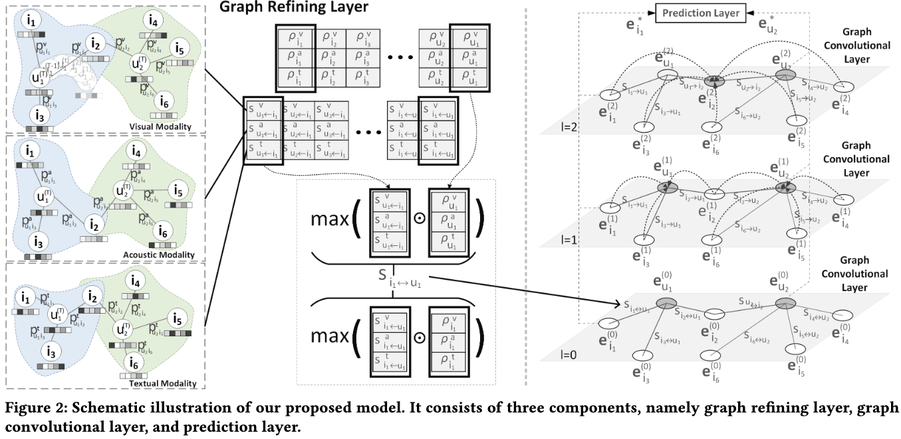

# Graph-Refined Convolutional Network for Multimedia Recommendation with Implicit Feedback

> A new GCN-based recommendation model, GRCN, which adaptively refines the structure of the interaction graph to discover and prune potential false-positive edges.

## Authors

**Yinwei Wei**\*, **Xiang Wang**, **Liqiang Nie**, **Xiangnan He**, **Tat-Seng Chua**

\* Corresponding author (weiyinwei at hotmail.com)

## Links

- **Paper**: [`ACM MM'20`](https://dl.acm.org/doi/pdf/10.1145/3394171.3413556)
- **Code Repository**: [`GitHub`](https://github.com/iLearn-Lab/MM20-GRCN)

---



---

## Updates

- [10/2020] Paper presented at ACM MM'20.

---

## Introduction

This is the official PyTorch implementation for the paper **Graph-Refined Convolutional Network for Multimedia Recommendation with Implicit Feedback** (ACM MM'20).

In this work, we focus on adaptively refining the structure of the interaction graph to discover and prune potential false-positive edges. Towards this end, we devise a new GCN-based recommendation model, **Graph-Refined Convolutional Network (GRCN)**, which adjusts the structure of the interaction graph adaptively based on the status of model training, instead of remaining with a fixed structure.

---

## Highlights

- Adaptively refines the bipartite interaction graph during training.
- Identifies and prunes potential false-positive edges to denoise implicit feedback.
- Supports flexible configurations for multimodal integration strategies (`mean`, `max`, `confid`), prediction fusion modes (`concat`, `mean`, `id`), and pruning operations (hard vs. soft).

---

## Installation
The code has been tested running under Python 3.5.2. The required packages are as follows:

* Pytorch == 1.4.0
* torch-cluster == 1.4.2
* torch-geometric == 1.2.1
* torch-scatter == 1.2.0
* torch-sparse == 0.4.0
* numpy == 1.16.0

## Dataset / Benchmark
We validate our model on three datasets: Movielens, Tiktok, and Kwai.

Please check the MMGCN repository for access to the datasets. Due to copyright restrictions, we could only provide toy datasets for validation. If you need the complete ones, please contact the owners of the respective datasets.

| Dataset | #Interactions | #Users | #Items | Visual | Acoustic | Textual |
| :--- | :--- | :--- | :--- | :--- | :--- | :--- |
| **Movielens** | 1,239,508 | 55,485 | 5,986 | 2,048 | 128 | 100 |
| **Tiktok** | 726,065 | 36,656 | 76,085 | 128 | 128 | 128 |
| **Kwai** | 298,492 | 86,483 | 7,010 | 2,048 | - | - |

Sources
https://github.com/iLearn-Lab/MM20-GRCN
https://github.com/weiyinwei/GRCN

`train.npy: Train file. Each line is a user with her/his positive interactions with items (userID and micro-video ID).`

`val.npy: Validation file. Each line is a user with her/his several positive interactions with items (userID and micro-video ID).`

`test.npy: Test file. Each line is a user with her/his several positive interactions with items (userID and micro-video ID).`

---

## Usage
The instruction of commands has been clearly stated in the codes. Run the following examples to start training the model on different datasets:

### Kwai Dataset

`python main.py --l_r=0.0001 --weight_decay=0.1 --dropout=0 --weight_mode=confid --num_routing=3 --is_pruning=False --data_path=Kwai --has_a=False --has_t=False`

### Tiktok Dataset

`python main.py --l_r=0.0001 --weight_decay=0.001 --dropout=0 --weight_mode=confid --num_routing=3 --is_pruning=False --data_path=Tiktok`

###Movielens Dataset

`python main.py --l_r=0.0001 --weight_decay=0.0001 --dropout=0 --weight_mode=confid --num_routing=3 --is_pruning=False`

## Key Arguments
`--weight_model`: Type of multimodal correlation integration. Options:

mean: Mean integration without confidence vectors.

max: Max integration without confidence vectors.

confid (default): Max integration with confidence vectors.

`--fusion_mode`: Type of user and item representation in the prediction layer. Options:

concat (default): Concatenation of multimodal features.

mean: Mean pooling of multimodal features.

id: Representation with only the id embeddings.

`--is_pruning`: Type of pruning operation. Options:

True (default): Implements hard pruning operations.

False: Implements soft pruning operations.

`--has_v`, `--has_a`, `--has_t`: Boolean flags indicating whether Visual, Acoustic, or Textual modalities are used.

## Citation
If you use this code or our proposed model in your research, please consider citing:

``` 
Code snippet
@inproceedings{GRCN,
  title     = {Graph-Refined Convolutional Network for Multimedia Recommendation with Implicit Feedback},
  author    = {Wei, Yinwei and Wang, Xiang and Nie, Liqiang and He, Xiangnan and Chua, Tat-Seng},
  booktitle = {Proceedings of the 28th ACM International Conference on Multimedia},
  pages     = {XXXX--XXXX},
  year      = {2020}
}
``` 
